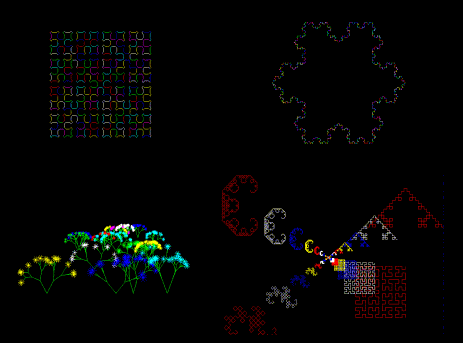



## Logo Engine Vers\.2

### Description

This is an old project that i've realized on my great Commodore 64 more years ago.

Now i've ported all in VB.

This engine emulates the LOGO commands: Forward, Back, Left, Right, PenUp. PenDown.

With this version contains :

1) very simple management of colors.

2) very simple management of the zoom factor

3) a couple of commands to manage the direction and the position of the turtle

4) more samples that shows some classical curves.

Enjoy with this program and Tell me what do you think about,please.

Bye.
 
### More Info
 

             |
---                |---
**Submitted On**   |2005-11-29 11:08:04
**By**             |[Marco Pistorio](https://github.com/Planet-Source-Code/PSCIndex/blob/master/ByAuthor/marco-pistorio.md)
**Level**          |Beginner
**User Rating**    |4.3 (13 globes from 3 users)
**Compatibility**  |VB 6\.0
**Category**       |[Graphics](https://github.com/Planet-Source-Code/PSCIndex/blob/master/ByCategory/graphics__1-46.md)
**World**          |[Visual Basic](https://github.com/Planet-Source-Code/PSCIndex/blob/master/ByWorld/visual-basic.md)
**Archive File**   |[Logo\_Engin19520611292005\.zip](https://github.com/Planet-Source-Code/marco-pistorio-logo-engine-vers-2__1-63410/archive/master.zip)

